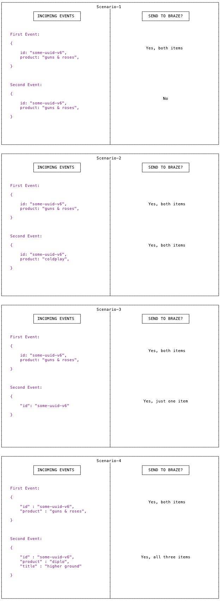

# Segment<>Braze Middleware

Official repository explaining the `Braze Debounce Identify()` functionality for customers using both products via direct Segment integration. This codebase is only an example for iOS and Android. For `analytics.js` you can directly access similar functionality via [source settings](https://app.segment.com) as explained [here](https://www.segment.com/docs/connections/sources/catalog/libraries/website/javascript/#middleware). This contains example code to enable Braze Debounce Identify on mobile client in addition to sample apps to help get you started on [iOS](/iOS/) and [Android](/Android/).

## What are middlewares?
Middlewares are a powerful mechanism that can augment the events collected by the SDK. A middleware is a simple function that is invoked by the Segment SDK and can be used to monitor, modify or reject events. They are available across all analytics-{ [ios](https://segment.com/docs/sources/mobile/ios/#middlewares) | [android](https://segment.com/docs/sources/mobile/android/#middlewares) | [js](https://www.segment.com/docs/connections/sources/catalog/libraries/website/javascript/#middleware)}

## Why was this Braze middleware built?
Segment customers are not charged for duplicate `identify()` calls hence default client app and Segment SDK behavior is to aggresively call this endpoint. Braze on the other hand is priced such that customers are charged per data point stored (incuding duplicates). To help customers avoid overage, this middleware was built to avoid sending duplicate user traits to Braze on every `identify()` call inside Segment.

## How does this work?
The core functionality that this middleware adds can be explained with the following pseudo-code:
```
if payload is IdentityPayload {
    if payload.userId != lastUserID or
       payload.anonymousId != lastAnonymousID or
       payload.traits != lastTraits {
            // do nothing, it'll get sent like normal.
       } else {
            removeBrazeFromDestinationList()
       }
}

```

The illustration below further elaborates upon this logic:



## Does this work under both cloud and device mode?
Yes. This middleware works under both [cloud and device modes](https://segment.com/docs/destinations/#connection-modes) for the Segment<>Braze [integration](https://segment.com/docs/sources/cloud-apps/braze/). There is not confguration or implementation burden on you and the Segment libraries take care of this internally.

## How do I add this?
You can follow our platform specific guides to help you add this middleware to your native mobile projects:
1. [Android: Java](/Android/README.md)
2. [iOS: Objective-C](/iOS/Objective-C/README.md)
3. [iOS: Swift](/iOS/Swift/README.md)

For your Website sources of type Javascript or Project under Segment please follow directions [here](https://www.segment.com/docs/connections/sources/catalog/libraries/website/javascript/#middleware).

## More information
Please [contact us](https://segment.com/help/) for more information on this middleware, or if you have further questions.


